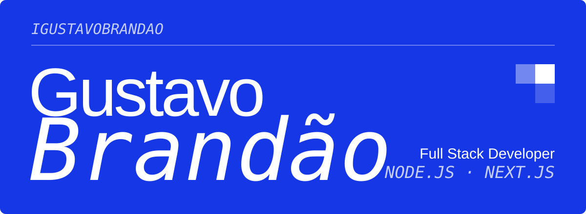
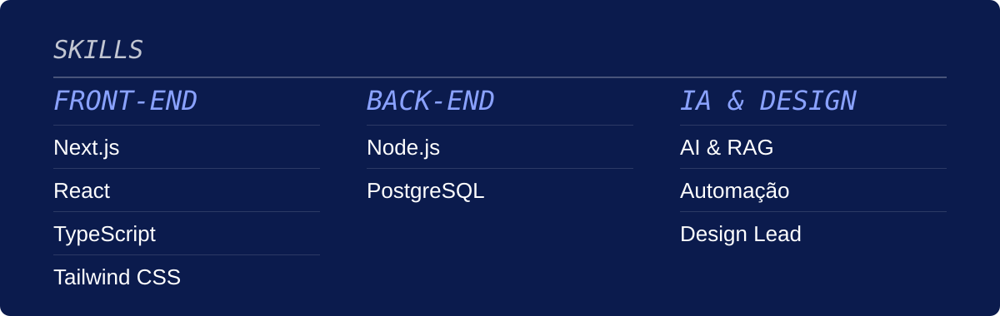
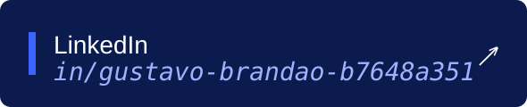

## Sobre Mim

Desenvolvedor Full Stack trabalhando com **Next.js**, **Node.js** e **PostgreSQL**. Experiência com integração de IA usando **LangChain**, **RAG**, **embeddings** e bancos vetoriais. Design systems e componentes reutilizáveis.

## Experiência Profissional

### Olho no Leilão
**Desenvolvedor Frontend**

Responsável por melhorias na arquitetura de UI utilizando:
- **Componentes reutilizáveis**: Estruturação de bibliotecas de componentes com padrões de design consistentes
- **Tokens CSS**: Implementação de sistemas de tokens para cores, tipografia, spacing e breakpoints
- **Componentização**: Refatoração de código em componentes menores e mais manuteníveis
- **Padrões de design**: Aplicação de design systems para garantir coesão visual em toda a aplicação

**Link:** https://olhonoleilao.com/

---

### Syncabyte Finance
**Desenvolvedor Frontend**

Desenvolvimento e otimização da plataforma de finanças com foco em:
- **Arquitetura de componentes**: Estruturação escalável de UI com React/TypeScript
- **Tokens CSS**: Sistema de design tokens para consistência visual e facilitação de manutenção
- **Performance**: Otimização de renderização e carregamento de componentes
- **Responsividade**: Implementação de interfaces adaptáveis para múltiplos dispositivos

**Link:** https://finance.syncabyte.com/

---

### Mutual Capital
**Design Lead & Desenvolvedor Frontend**

Liderança na prototipagem de produtos e desenvolvimento frontend:
- **Prototipagem**: Design e validação de protótipos de novas funcionalidades
- **Design System**: Criação e evolução de sistema de design com componentes reutilizáveis
- **Componentes**: Implementação de componentes de alta qualidade com TypeScript e Tailwind CSS
- **UI/UX**: Refinamento de interfaces focando em usabilidade e experiência do usuário

**Link:** https://mutualcapital.com.br/

---

### MonkeyPay
**Desenvolvedor Full Stack Junior**

Desenvolvimento full stack com ênfase em melhorias de UI/UX:
- **UI/UX Improvements**: Redesign e otimização de interfaces focando em usabilidade e acessibilidade
- **Componentes reutilizáveis**: Criação de biblioteca de componentes padronizados
- **Tokens CSS**: Implementação de sistema de tokens para manutenção facilitada
- **Bug Fixes**: Correção de issues críticas e melhorias de performance
- **Design tokens**: Uso de variáveis de design para escalabilidade

**Link:** https://monkeypay.app/

---

  
  

