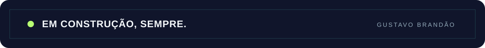

  

 

### Olá, eu sou o Gustavo 👋

Da gestão acadêmica à transcrição por voz: crio software que transforma ideias em ferramentas úteis.
Gosto de juntar interfaces claras, código e curiosidade para resolver problemas reais.

---

### Projetos em destaque

| Projeto | O que faz | Tecnologias |
| :--- | :--- | :--- |
| [SIGRA ↗](https://github.com/igustavobrandao/SIGRA) | Organiza e compartilha materiais acadêmicos entre estudantes e administradores. | React · TypeScript · Supabase |
| [SpeaklyAI ↗](https://github.com/igustavobrandao/SpeaklyAI) | Transforma fala em texto no Windows com atalhos globais e transcrição por IA. | Python · Whisper API · SQLite |
| [Cobra Neon ↗](https://github.com/igustavobrandao/cobra) | Reimagina o jogo da cobrinha com combos, áudio e visual neon. | React · TypeScript · Tailwind CSS |

[Ver todos os repositórios ↗](https://github.com/igustavobrandao?tab=repositories)

### Como eu trabalho

`interfaces bem pensadas` · `ferramentas úteis` · `aprendizado contínuo`

> Aprender, construir, revisar, repetir. É assim que uma ideia vira algo melhor a cada versão.

Se algum projeto despertar uma ideia, uma sugestão ou uma conversa, [fale comigo pelo GitHub ↗](https://github.com/igustavobrandao).

  

